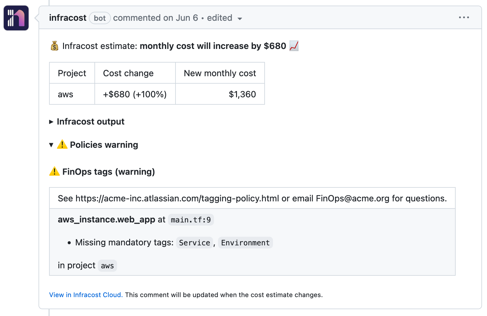

# Infracost Jenkins

This project provides instructions for using Infracost in a Jenkins pipeline. This enables you to see cloud cost estimates for Terraform in pull requests. 💰


## Quick start


1. If you haven't done so already, [download Infracost](https://www.infracost.io/docs/#quick-start) and run `infracost auth login` to get a free API key.

2. Retrieve your Infracost API key by running `infracost configure get api_key`.

3. Create a new credential in Jenkins' management panel, called `jenkins-infracost-api-key`, and enter your Infracost API key.

4. Create a new file at `Jenkinsfile` in your repo with the following content and update it to match your environment.

```
pipeline {
    agent any
    stages {
        stage('infracost') {
            agent {
                docker {
                    // Always use the latest 0.10.x version to pick up bug fixes and new resources.
                    // See https://www.infracost.io/docs/integrations/cicd/#docker-images for other options
                    image 'infracost/infracost:ci-0.10'
                    args "--user=root --entrypoint=''"
                }
            }

            // Set up any required credentials for posting the comment, e.g. GitHub token, GitLab token
            environment {
                INFRACOST_API_KEY = credentials('jenkins-infracost-api-key')
                // The following environment variables are required to show Jenkins PRs on Infracost Cloud.
                //  These are the minimum required, and you should alter to conform to your specific setup.
                //  To read more about additional environment variables you can use to customize Infracost Cloud,
                //  visit here: https://www.infracost.io/docs/features/environment_variables/#environment-variables-to-set-metadata
                INFRACOST_VCS_PROVIDER = 'github'
                INFRACOST_VCS_REPOSITORY_URL = 'https://github.com/infracost/example-terraform'
                INFRACOST_VCS_PULL_REQUEST_URL = 'https://github.com/alikhajeh1/example-terraform/pull/22'
                INFRACOST_VCS_PULL_REQUEST_AUTHOR = 'John Smith'
                INFRACOST_VCS_PULL_REQUEST_TITLE = 'Change instance type'
                INFRACOST_VCS_BRANCH = 'bump-instances'
                INFRACOST_VCS_BASE_BRANCH = 'main'
                INFRACOST_VCS_COMMIT_SHA = '47d54ead06ff66d22369424e4142d74a01c30e66'
                // If you're using Terraform Cloud/Enterprise and have variables or private modules stored
                // on there, specify the following to automatically retrieve the variables:
                // INFRACOST_TERRAFORM_CLOUD_TOKEN: credentials('jenkins-infracost-tfc-token')
                // Change this if you're using Terraform Enterprise
                // INFRACOST_TERRAFORM_CLOUD_HOST: app.terraform.io
            }

            steps {
                // Clone the base branch of the pull request (e.g. main/master) into a temp directory.
                sh 'git clone $GIT_URL --branch=$CHANGE_TARGET --single-branch /tmp/base'

                // Generate Infracost JSON file as the baseline, add any required sub-directories to path, e.g. `/tmp/base/PATH/TO/TERRAFORM/CODE`.
                sh 'infracost breakdown --path=/tmp/base \
                                        --format=json \
                                        --out-file=/tmp/infracost-base.json'

                // Generate an Infracost diff and save it to a JSON file.
                sh 'infracost diff --path=PATH/TO/TERRAFORM/CODE \
                                   --format=json \
                                   --compare-to=/tmp/infracost-base.json \
                                   --out-file=/tmp/infracost.json'

                // Posts a comment to the PR using the 'update' behavior.
                // This creates a single comment and updates it. The "quietest" option.
                // The other valid behaviors are:
                //   delete-and-new - Delete previous comments and create a new one.
                //   hide-and-new - Minimize previous comments and create a new one.
                //   new - Create a new cost estimate comment on every push.
                // See https://www.infracost.io/docs/features/cli_commands/#comment-on-pull-requests for other options.
                sh 'infracost comment github --path=/tmp/infracost.json \
                                             --repo=$GITHUB_REPO \
                                             --pull-request=$GITHUB_PULL_REQUEST_NUMBER \
                                             --github-token=$GITHUB_TOKEN \
                                             --behavior=update'
            }
        }
    }
}
```

5. 🎉 That's it! Send a new pull request to change something in Terraform that costs money. You should see a pull request comment that gets updated, e.g. the 📉 and 📈 emojis will update as changes are pushed! Check the build Console Output and [this page](https://www.infracost.io/docs/troubleshooting/) if there are issues.

    

6. In [Infracost Cloud](https://dashboard.infracost.io), go to Org Settings and enable the dashboard, then trigger your CI/CD pipeline again. This causes the CLI to send its JSON output to your dashboard; the JSON does not contain any cloud credentials or secrets, see the [FAQ](https://infracost.io/docs/faq/) for more information.

    This is our SaaS product that builds on top of Infracost open source. It enables team leads, managers and FinOps practitioners to setup [tagging policies](https://www.infracost.io/docs/infracost_cloud/tagging_policies/), [guardrails](https://www.infracost.io/docs/infracost_cloud/guardrails/) and [best practices](https://www.infracost.io/docs/infracost_cloud/cost_policies/) to help guide the team. For example, you can check for required tag keys/values, or suggest switching AWS GP2 volumes to GP3 as they are more performant and cheaper.

    

## Private Terraform modules

If you use private Terraform modules in your project you'll need to correctly configure the Jenkins pipeline to fetch these. You can find more information about private modules [on our docs](https://www.infracost.io/docs/guides/terraform_modules/).

## Comment options

The Infracost CLI can post cost estimates to pull request or commits on GitHub, GitLab, Azure Repos and Bitbucket. Run `infracost comment --help` to see the the list of options or [see our docs](https://www.infracost.io/docs/features/cli_commands/#comment-on-pull-requests).

If you're using another source control system, see [this docs section](https://www.infracost.io/docs/integrations/cicd/#other-cicd-systems).

## Examples

We don't yet have examples for different use cases with Infracost for Jenkins, but we do have a selection of [examples for GitLab](https://gitlab.com/infracost/infracost-gitlab-ci/-/tree/master#examples) that can be modified to work with Jenkins.

## Contributing

Issues and pull requests are welcome. Please create issues in [this repo](https://github.com/infracost/infracost) or [join our community Slack](https://www.infracost.io/community-chat), we are a friendly bunch and happy to help you get started :)

## License

[Apache License 2.0](https://choosealicense.com/licenses/apache-2.0/)
