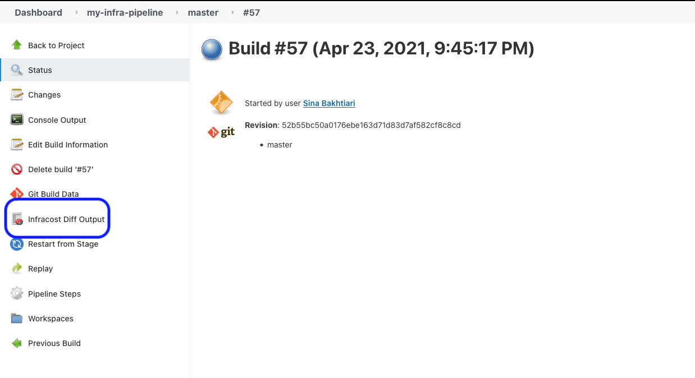

# Infracost Jenkins

This repo shows how Infracost can be used with Jenkins. Given the variety of workflows in Jenkins, this repo currently shows how a stage can be added to pipelines to generate an HTML page for each run, to show the Infracost diff output. It uses Jenkins' docker agent to run Infracost's [`jenkins_diff.sh`](https://github.com/infracost/infracost/blob/master/scripts/ci/jenkins_diff.sh) and was also tested using the [`docker:dind` image](https://www.jenkins.io/doc/book/installing/docker/#on-macos-and-linux) (docker in docker). Use this as a template that can be customized based on your requirements. See [this repo for a demo](https://github.com/infracost/jenkins-demo).

This integration uses the latest version of Infracost by default as we regularly add support for more cloud resources. If you run into any issues, please join our [community Slack channel](https://www.infracost.io/community-chat); we'd be happy to guide you through it.

As mentioned in the [FAQ](https://www.infracost.io/docs/faq), **no** cloud credentials, secrets, tags or resource identifiers are sent to the Cloud Pricing API. That API does not become aware of your cloud spend; it simply returns cloud prices to the CLI so calculations can be done on your machine. Infracost does not make any changes to your Terraform state or cloud resources.

<kbd></kbd>

## Parameters

Parameters can be passed in using the `environment` block of the `Jenkinsfile` file as shown in the Usage section below.

### `IAC_PATH`

**Optional** Path to the Terraform directory or JSON/plan file. Either `IAC_PATH` or `CONFIG_FILE` is required.

### `TERRAFORM_PLAN_FLAGS`

**Optional** Flags to pass to the 'terraform plan' command, e.g. `"-var-file=my.tfvars -var-file=other.tfvars"`. Applicable when path is a Terraform directory.

### `TERRAFORM_WORKSPACE`

**Optional** The Terraform workspace to use. Applicable when path is a Terraform directory. Only set this for multi-workspace deployments, otherwise it might result in the Terraform error "workspaces not supported".

### `USAGE_FILE`

**Optional** Path to Infracost [usage file](https://www.infracost.io/docs/usage_based_resources#infracost-usage-file) that specifies values for usage-based resources, see [this example file](https://github.com/infracost/infracost/blob/master/infracost-usage-example.yml) for the available options.

### `CONFIG_FILE`

**Optional** If your repo has **multiple Terraform projects or workspaces**, define them in a [config file](https://www.infracost.io/docs/config_file/) and set this input to its path. Their results will be combined into the same diff output. Cannot be used with IAC_PATH, TERRAFORM_PLAN_FLAGS or USAGE_FILE parameters.

### `FAIL_CONDITION`

**Optional** A JSON string describing the condition that causes the pipeline to fail. Currently only one option is supported:
- `'{"percentage_threshold": 10}'`: absolute percentage threshold that fails the build. For example, set to 10 to fail the build if the cost estimate changes by more than plus or minus 10%.

## Environment variables

This section describes the most common environment variables. Other supported environment variables are described in the [this page](https://www.infracost.io/docs/integrations/environment_variables).

Terragrunt users should also read [this page](https://www.infracost.io/docs/iac_tools/terragrunt). Terraform Cloud/Enterprise users should also read [this page](https://www.infracost.io/docs/iac_tools/terraform_cloud_enterprise).

### `INFRACOST_API_KEY`

**Required** To get an API key [download Infracost](https://www.infracost.io/docs/#installation) and run `infracost register`.

### Cloud credentials

**Required** You do not need to set cloud credentials if you use Terraform Cloud/Enterprise's remote execution mode, instead you should follow [this page](https://www.infracost.io/docs/iac_tools/terraform_cloud_enterprise).

For all other users, the following is needed so Terraform can run `init`:
- AWS users should set `AWS_ACCESS_KEY_ID` and `AWS_SECRET_ACCESS_KEY`.
- GCP users should set `GOOGLE_CREDENTIALS` or read [this section](https://registry.terraform.io/providers/hashicorp/google/latest/docs/guides/provider_reference#full-reference) of the Terraform docs for other options.

### `INFRACOST_TERRAFORM_BINARY`

**Optional** Used to change the path to the `terraform` binary or version, see [this page](https://www.infracost.io/docs/integrations/environment_variables/#cicd-integrations) for the available options.

### `GIT_SSH_KEY`

**Optional** If you're using Terraform modules from private Git repositories you can set this environment variable to your private Git SSH key so Terraform can access your module.

## Usage

1. Create a new credential in Jenkins' management panel, called `jenkins-infracost-api-key`, and enter your Infracost API key. To get an API key [download Infracost](https://www.infracost.io/docs/#installation) and run `infracost register`.

2. Install the Jenkins [HTML Publisher plugin](https://plugins.jenkins.io/htmlpublisher/). This is used to output the diff result in an HTML file.

3. Add a new stage to your Jenkins' pipeline by updating your project's `Jenkinsfile` as shown below:
    ```
    pipeline {
        agent any
        stages {

            stage('infracost') {
                agent {
                    docker {
                        image 'infracost/infracost:latest'
                        // The image needs to run as root as it creates files in ~/.config
                        // Also override the entrypoint to do nothing as we define that in steps below
                        args "--user=root --entrypoint=''"
                    }
                }

                environment {
                    INFRACOST_API_KEY = credentials('jenkins-infracost-api-key')
                    IAC_PATH = 'path/to/code'
                }

                steps {
                    // Do not change
                    sh '/scripts/ci/jenkins_diff.sh'

                    // This ensures that the 'jenkins' user can cleanup without running into permission issues for
                    // files/folders that Terraform created (such as .terraform)
                    sh 'chmod -R 777 .'

                    publishHTML (target: [
                        allowMissing: false,
                        alwaysLinkToLastBuild: false,
                        keepAll: true,
                        reportDir: './',
                        reportFiles: 'infracost_diff.html',
                        reportName: 'Infracost Diff Output'
                    ])
                }
            }
        }
    }
    ```

4. Push a change to your project or manually trigger a run; the Infracost Diff Output menu option should appear in your Jenkins project. Check the build Console Output and [this page](https://www.infracost.io/docs/integrations/cicd#cicd-troubleshooting) if there are issues.

## Contributing

Merge requests are welcome. For major changes, please open an issue first to discuss what you would like to change.

## License

[Apache License 2.0](https://choosealicense.com/licenses/apache-2.0/)
