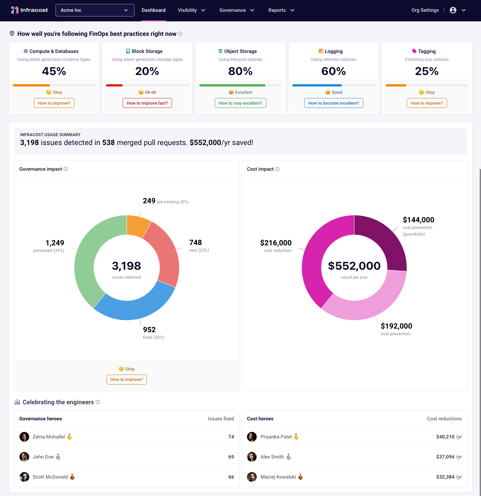

# Infracost Jenkins

This project provides the Jenkins integration for Infracost, so you can see cloud cost estimates and FinOps best practices for Terraform in pull requests 💰

## Quick start

This guide is for using Jenkins with GitHub and Bitbucket. GitHub users can also consider using the [Infracost GitHub App](https://www.infracost.io/docs/integrations/github_app/) as it's much simpler to setup and faster to run. If you use Jenkins with Azure DevOps Repos or GitLab, please email [hello@infracost.io](mailto:hello@infracost.io) so we can discuss your requirements and support you.

1. If you haven't done so already, [download Infracost](https://www.infracost.io/docs/#quick-start) and run `infracost auth login` to get a free API key.

2. Retrieve your Infracost API key by running `infracost configure get api_key`.

3. Create a new credential in Jenkins' management panel (or wherever you store credentials), called `infracost-api-key`, and enter your Infracost API key.

4. Create credentials that Infracost will use to post pull request comments. This should be a credential in Jenkins' management panel (or wherever you store credentials), called `github-token`, `bitbucket-app-password` or `bitbucket-access-token`.
  
    - For GitHub, create a GitHub token, such as [Personal Access Token](https://docs.github.com/en/authentication/keeping-your-account-and-data-secure/creating-a-personal-access-token), that can be used by the Infracost CLI in the Jenkinsfile to post comments. The token needs to have `repo` scope so it can post comments. If you are using SAML single sign-on, you must first [authorize the token](https://docs.github.com/en/enterprise-cloud@latest/authentication/authenticating-with-saml-single-sign-on/authorizing-a-personal-access-token-for-use-with-saml-single-sign-on).
    - For Bitbucket Cloud, you can either use a App password (recommended) or a Repository access token.
        - To generate a App password go to your Personal Settings > App passwords and generate a password that has read and write permissions for Repositories and Pull requests.
        - To generate a Repository access token go to Repository Settings > Access tokens and generate a token that has read and write permissions for Repositories and Pull requests.
    - For Bitbucket Server, set this to your [HTTP access token](https://confluence.atlassian.com/bitbucketserver/http-access-tokens-939515499.html). Read-only repository permission should be enough as the [their docs](https://confluence.atlassian.com/bitbucketserver/using-repository-permissions-776639771.html) mentions that "comment on a pull request" is allowed too.

5. Implement the [GitHub Jenkinsfile](github.jenkinsfile) or the [Bitbucket Jenkinsfile](bitbucket.jenkinsfile) in your Jenkins. Note how the Jenkinsfile has two key steps:
    - one step that runs on pull requests and posts the pull request comment
    - another step that runs when the main/master branch is updated to upload the results to Infracost Cloud

6. Follow [these simple steps](https://www.infracost.io/docs/infracost_cloud/get_started/#4-send-a-pull-request) to test the integration.

7. [Infracost Cloud](https://dashboard.infracost.io) is our SaaS product that builds on top of Infracost open source. It enables team leads, managers and FinOps practitioners to setup [tagging policies](https://www.infracost.io/docs/infracost_cloud/tagging_policies/), [guardrails](https://www.infracost.io/docs/infracost_cloud/guardrails/) and [best practices](https://www.infracost.io/docs/infracost_cloud/cost_policies/) to help guide the team. For example, you can check for required tag keys/values, or suggest switching AWS gp2 volumes to gp3 as they are more performant and cheaper.

    If you **do not** want to use [Infracost Cloud](https://dashboard.infracost.io), go to Org Settings and disable the dashboard. This causes the CLI not to send its JSON output to your dashboard; the JSON does not contain any cloud credentials or secrets, see the [FAQ](https://infracost.io/docs/faq/) for more information.

    

## Private Terraform modules

If you use private Terraform modules in your project you'll need to correctly configure the Jenkins pipeline to fetch these. You can find more information about private modules [on our docs](https://www.infracost.io/docs/guides/terraform_modules/).

## Comment options

The Infracost CLI can post cost estimates to pull request or commits on GitHub, GitLab, Azure Repos and Bitbucket. Run `infracost comment --help` to see the the list of options or [see our docs](https://www.infracost.io/docs/features/cli_commands/#comment-on-pull-requests).

## Contributing

Issues and pull requests are welcome. Please create issues in [this repo](https://github.com/infracost/infracost) or [join our community Slack](https://www.infracost.io/community-chat), we are a friendly bunch and happy to help you get started :)

## License

[Apache License 2.0](https://choosealicense.com/licenses/apache-2.0/)
